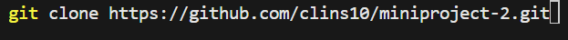
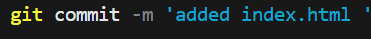

# Version Control System

## Introduction

This mini-project demonstrate the importance of Git as a VCS, a vital tool in Software development for collaboration, development, and version control.
How it ensures that all contributions are preserved and integrated efficiently and effectively.
Using analogy of two individuals Tom and Jerry working collaboratively on a project.

### Conceptualizing The Concept with Tom and Jerry

1. Initial Setup:
   - Both Tom and Jerry installed Git on their computers and then cloned the project _*miniproject-2*_ to their local machines. So they each have a copy of the project including the files and the version history.
   - Here, i cloned the the created project to my local machine.
   

2. Tom and Jerry Start Working:
   - I first, created the _index.html_ file in the _main/master_ branch.
   - Added and pushed the changes to the _main/master_ branch.
    
    
   - Then created and switched to the _updated-navigation-Tom_ branch
    
   - pulled the latest changes from the central repository.
    
   - Added the _nav bar_ section to the _*index.html*_ file and pushed the changes to the _*updated-navigation-Tom*_ branch.
    
   - Repeated the same procedure for Jerry.

3. Merging Changes:

   - After successfully pushing the updates to each branch.
   - I switch to each branch and made a Pull Request (PR) and then switch to the master branch, accepted the PRs, resolved the conflicts, and merged the changes.
  Tom PR:
   
  Merge Jerry PR:
   ](img/2.merged-jerryPR-successful.png)

### Conclusion

This project demonstrated  how teams members can work simultaneously, without overwriting each other's changes.
Git tracked their changes, allowing them to merge their updates stress-freely into the main project.
